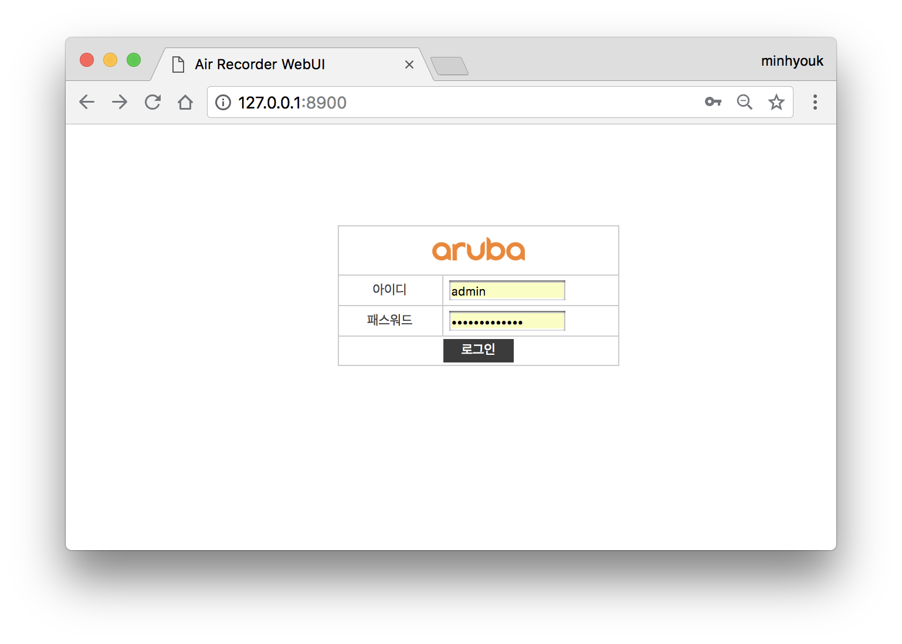
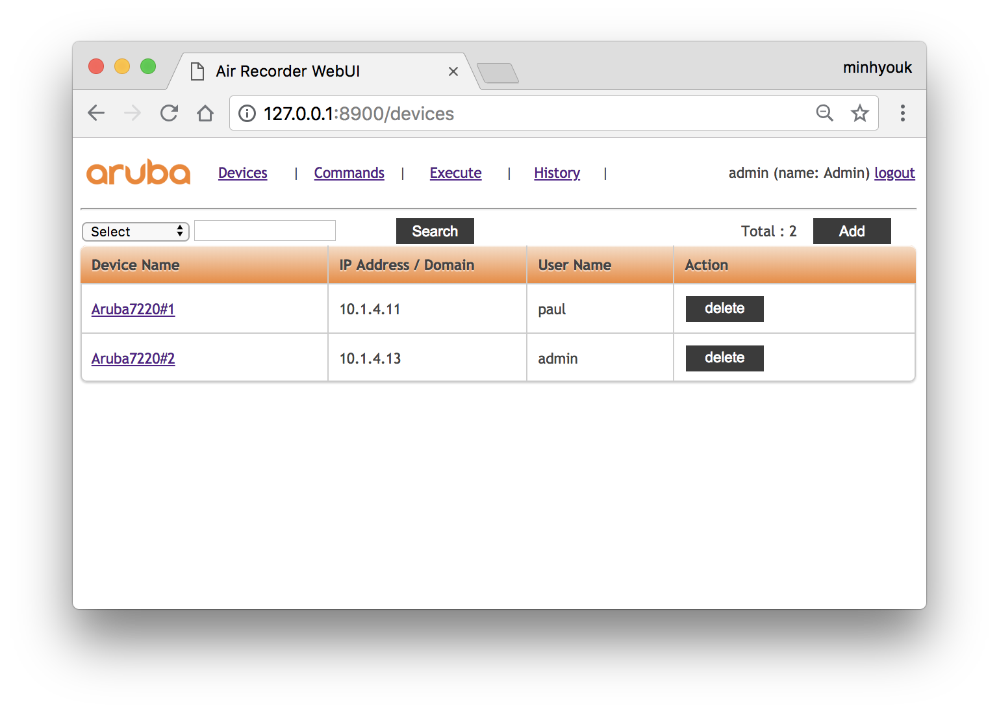
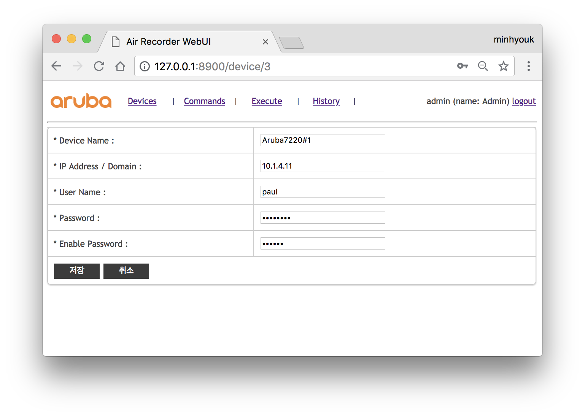
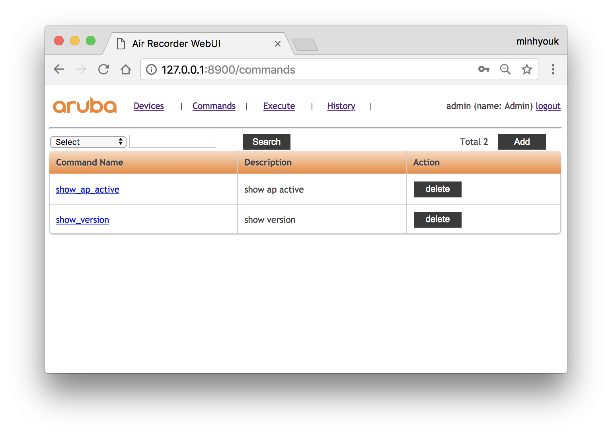
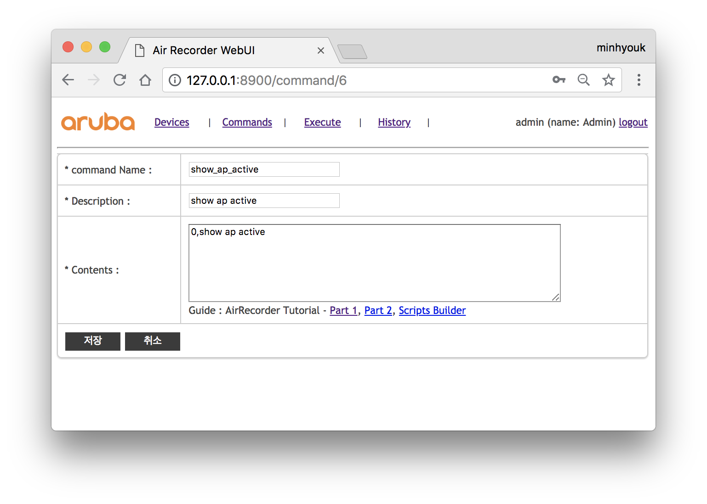
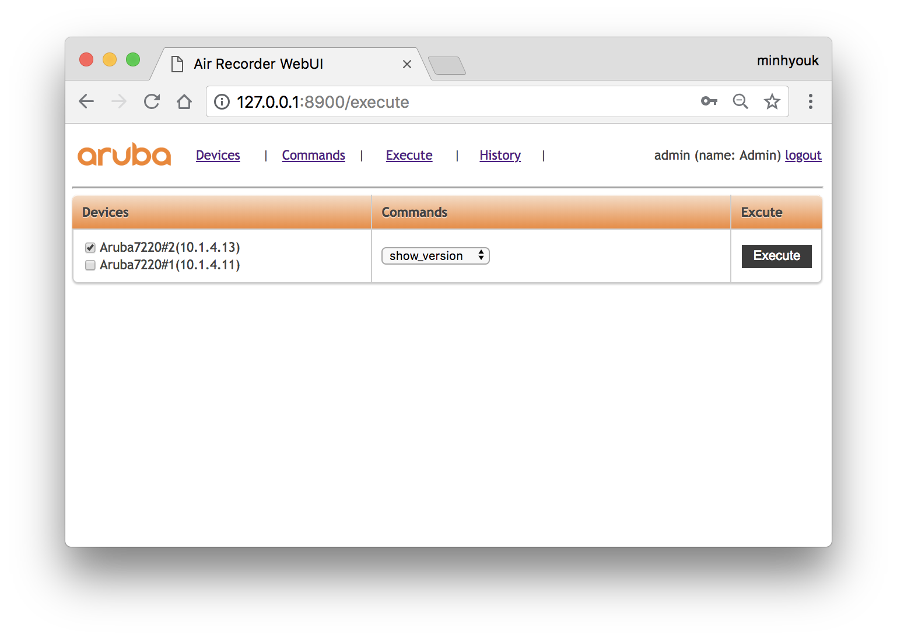
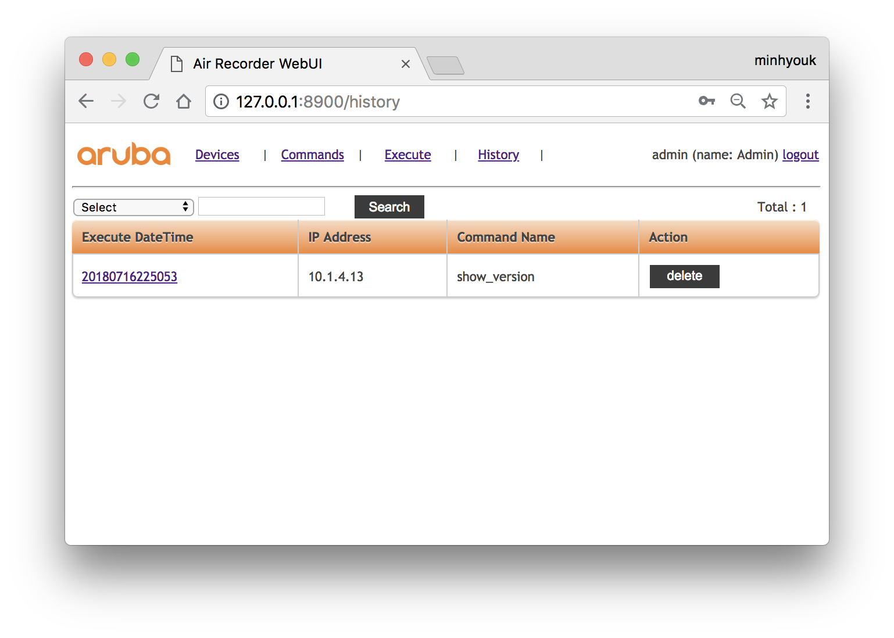
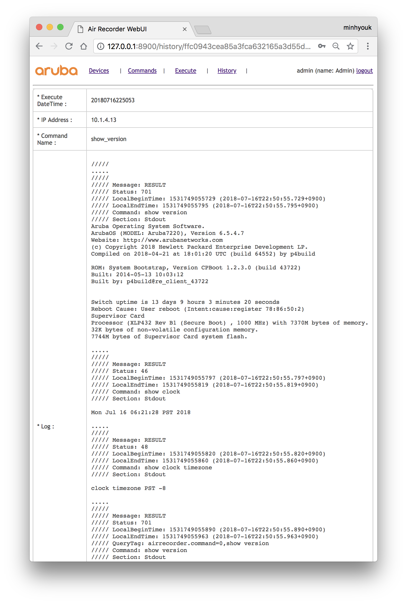

# Air Recorder WEB UI

------------------------------------------------------------------------------
### Nodejs Install
------------------------------------------------------------------------------
[NodeJS Download](https://nodejs.org/en/download/)

[JDK Download](http://www.oracle.com/technetwork/java/javase/downloads/index.html)

------------------------------------------------------------------------------
### Download AirRecorder_WEB_UI
------------------------------------------------------------------------------
https://github.com/aruba-paulkim/AirRecorder_WEB_UI

------------------------------------------------------------------------------
### Starting Service
------------------------------------------------------------------------------
<pre>git clone https://github.com/aruba-paulkim/AirRecorder_WEB_UI.git
cd AirRecorder_WEB_UI
npm install
npm start</pre>
connect to http://127.0.0.1:8900

------------------------------------------------------------------------------
### Login
------------------------------------------------------------------------------
default id : admin
default pw : arwebuiAdmin!

------------------------------------------------------------------------------
### Devices
------------------------------------------------------------------------------
add your devices

------------------------------------------------------------------------------
### Commands
------------------------------------------------------------------------------
make your script for air recorder 

reference

- [AirRecorder Tutorial - Part 1](http://community.arubanetworks.com/t5/Community-Tribal-Knowledge-Base/AirRecorder-Tutorial-Part-1/ta-p/157646)
- [AirRecorder Tutorial - Part 2](http://community.arubanetworks.com/t5/Community-Tribal-Knowledge-Base/AirRecorder-Tutorial-Part-2/ta-p/221390)
- [Automated Entry for Air Recorder Scripts](https://ase.arubanetworks.com/solutions/id/90)

------------------------------------------------------------------------------
### Execute
------------------------------------------------------------------------------

execute commands on your devices using air recorder

------------------------------------------------------------------------------
### History
------------------------------------------------------------------------------
check history of executing commands 

See Also 
[AirRecorder_WEB_UI](https://arubapedia.arubanetworks.com/arubapedia/index.php/AirRecorder_WEB_UI)

